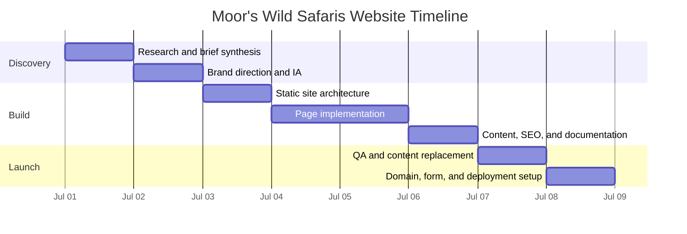

# QA and Handoff Checklist

## Timeline

## Functional QA

- Open `index.html` locally.
- Click every top navigation link.
- Click footer links.
- Test mobile navigation at narrow viewport widths.
- Test gallery filters.
- Open and close the gallery lightbox with click and Escape.
- Submit the contact form empty and confirm validation text appears.
- Submit valid contact details and confirm the email draft opens.

## Responsive QA

- Check 390px mobile width.
- Check 768px tablet width.
- Check 1280px desktop width.
- Confirm text does not overflow buttons, cards, or form fields.
- Confirm hero content remains readable over the image.
- Confirm the gallery grid collapses cleanly on mobile.

## Accessibility QA

- Tab through the page from the address bar.
- Confirm focus outlines are visible.
- Confirm skip link appears on focus.
- Confirm navigation button exposes expanded state.
- Confirm form fields have visible labels.
- Confirm image alt text is meaningful.
- Confirm reduced motion preference disables animated transitions.

## SEO QA

- Confirm each page has a unique title and meta description.
- Update canonical domain before launch if needed.
- Confirm `robots.txt` references the final sitemap URL.
- Confirm `sitemap.xml` lists all live pages.
- Replace generated placeholder imagery with real client photography when available.
- Add real Google Business Profile link and verified reviews when available.

## Launch Notes

- The current build is static and has no backend dependency.
- The inquiry form opens a prepared email draft to `info@moorswildsafaris.com`.
- If a true form submission flow is required, connect the form to a provider such as Netlify Forms, Formspree, a CRM endpoint, or a custom backend.
- Final privacy and booking terms should be reviewed by the business before publishing.
